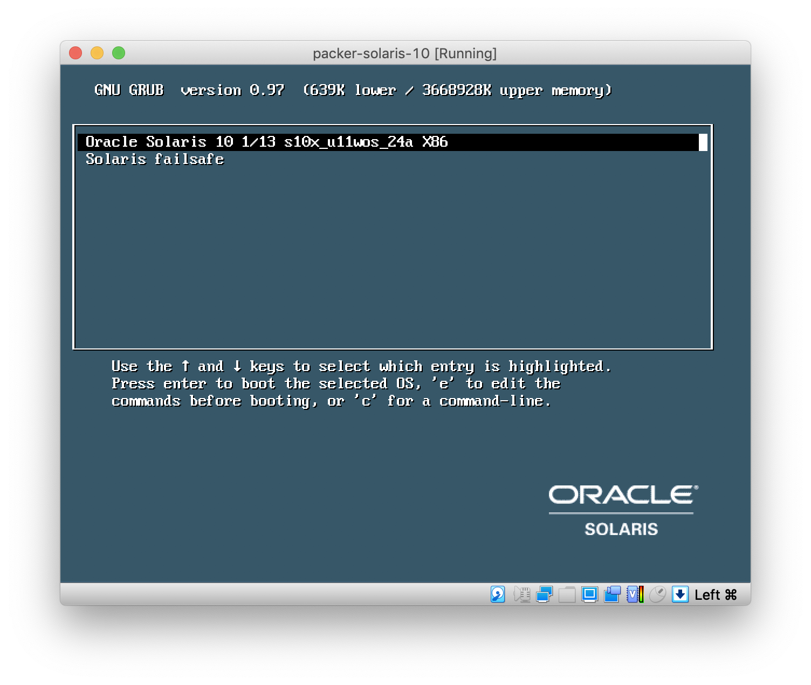
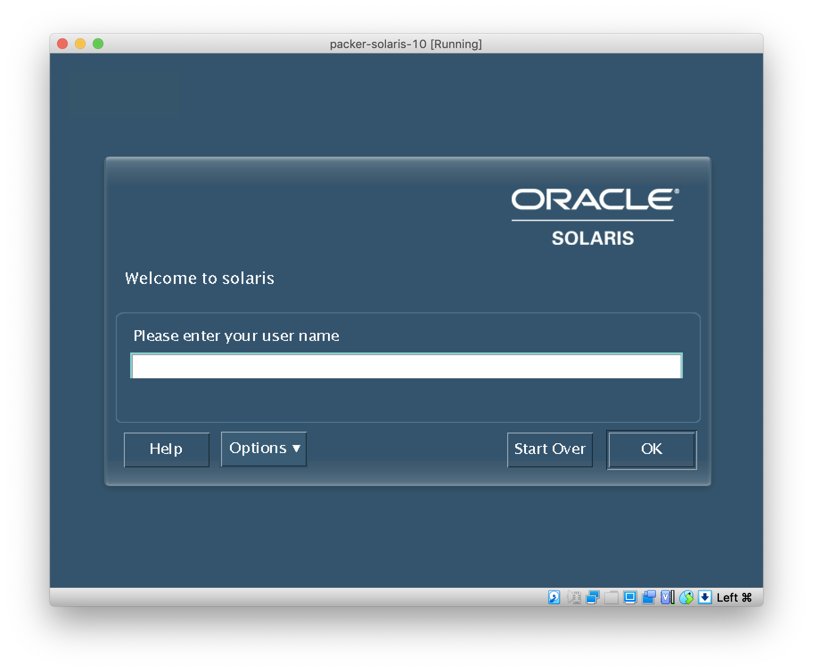
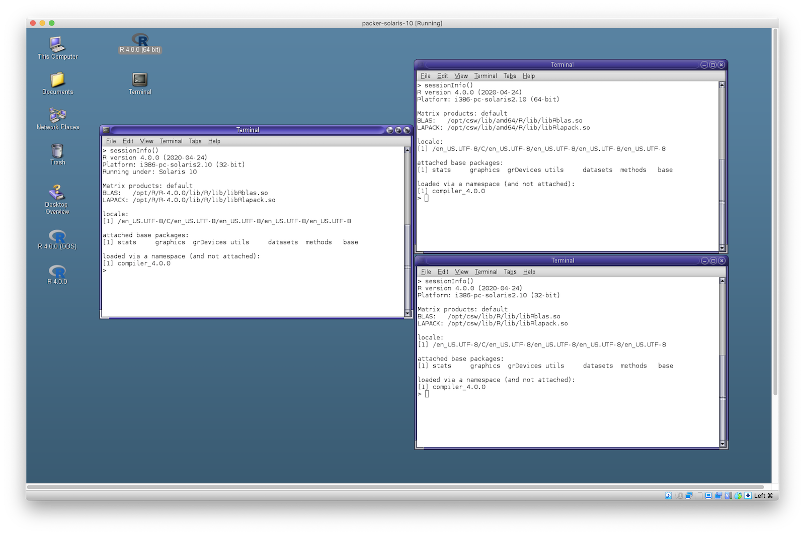
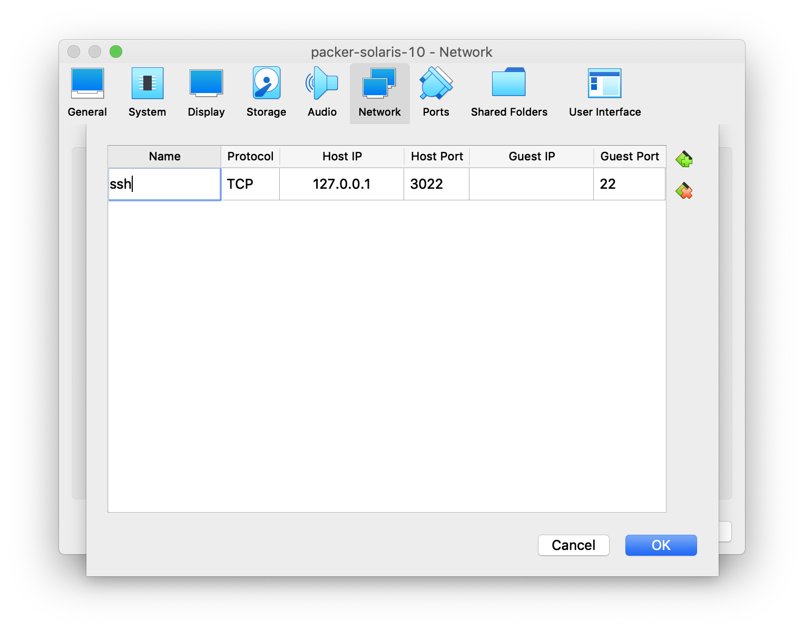

# Solaris VM for R

This repository contains tools to build your own Solaris virtual
machine, specially tailored for R users. It uses [packer](https://packer.io)
to automate the Solaris installation.

## Installation

1.  Download packer from <https://www.packer.io/downloads/.> packer
    supports Windows, macOS, Linux and other systems. On macOS you can
    install packer from brew:

        brew install packer

2.  You need to download a Solaris 10 ISO image. Download from Oracle
    require a free Oracle account. Go to
    <https://www.oracle.com/solaris/solaris10/downloads/solaris10-get-jsp-downloads.html>
    and download the `sol-10-u11-ga-x86-dvd.iso` file.

3.  You also need to download Oracle Developer Studio (ODS), version
    12.6. You need this even if you plan to use GCC exclusively,
    because it has important patches, without which GCC does not work
    correctly. Go to
    <https://www.oracle.com/tools/developerstudio/downloads/developer-studio-jsp.html>
    and download the "SVR4 installer on x86."

4.  Clone this repository and edit the `solaris10.json` file. In the
    JSON file, specify the locations of the downloaded ISO image file,
    and the ODS bundle. The names of the two files must be
    `sol-10-u11-ga-x86-dvd.iso` and
    `OracleDeveloperStudio12.6-solaris-x86-pkg.tar.bz2`. For example:

        {
          "variables": {
            "iso_location": "/Users/gaborcsardi/Downloads",
            "ods_location”: “/Users/gaborcsardi/Downloads",
            "harddisk_size": "40960",
            "vm_name": "solaris10"
          },
        ...

5.  You need to install either VirtualBox (see
    [https://www.virtualbox.org/wiki/Downloads),](https://www.virtualbox.org/wiki/Downloads),)
    or a VMware product (e.g. [VMware
    Fusion](https://www.vmware.com/products/fusion/overview.html) on
    macOS or [VMware
    Workstation](https://www.vmware.com/products/workstation/overview.html)
    on Linux or Windows). If you have both, then packer will build VMs
    for both, in parallel. If you don't want two VMs, see the
    documentation of the `packer build` command on how to specify the
    one you want.

6.  Run packer from a terminal, from the `packer` sub-directory within
    your `solarischeck` clone:

        packer build

7.  packer needs a live internet connection to download and install
    various tools to the VM, and it the whole process takes about
    15-25 minutes. It is fully automated. VirtualBox or VMware does
    show the window of the VM while it is being built, but do not
    interact with this window. It might fail the build.

8.  Once packer has finished it creates a `.box` file in the `build`
    sub-directory. This `.box` file is the compressed virtual machine
    or a compressed virtual appliance. Decompress the `.box` file with
    `tar`. E.g.:

        tar xzf solaris10-x86_64.box

    This either creates an `.ovf` file (typically for VirtualBox), or
    a `.vmx` file and a bunch of other file (typically for VMware).
    (If you want to use solaris as a
    `Vagrant (`[https://www.vagrantup.com/)](https://www.vagrantup.com/))
    box, then you can use the `.box` files directly, no need to
    extract them.)

9.  If you built an `.ovf` file, you can *Import* it in VirtualBox,
    using the default import settings. You end up with a VirtualBox
    virtual machine and you can clean up the `.box`, the `.ovf` and
    other files.

10. If you got a `.vmx` file, that is already a VMware VM. You can
    open it in VMware. If you prefer to move it to the standard place
    of VMware VMs, clone it in VMware. After cloning, you can delete
    the `.box`, the `.vmx` and other files.

## Using the VM

### Users

-   The user name is `rhub` and the password is `solaris`.

-   There is also a `vagrant` user, with password `vagrant`, which is
    useful if you want to use the VM through Vagrant.

-   Both the `rhub` and `vagrant` users are set up to use `sudo`
    without a password. E.g. you will need `sudo` to install system
    packages, or shut down the machine. Use `sudo -s` to start a root
    sub-shell.

    

### R versions

There are three R versions on the VM. On the desktop of the `rhub`
user, there is an icon for each of the three
versions:

-   `R` (which is a shortcut for `/opt/csw/bin/R` is a 32-bit
    R-release version, R 4.0.0 at the time of writing, built with GCC
    5.5.0).

-   `/opt/R/R-4.0.0/bin/R` is a 32 bit version, built using Oracle
    Developer Studio. It is compatible with the `R`, so they can use
    the same package library. Some CRAN packages, notably everything
    that depends on Rcpp, do not build with this R build. This is the
    build that CRAN uses by default, except for the problematic
    packages, for which they use the 32-bit GCC build.

-   `/opt/csw/bin/amd64/R` is a 64-bit R-release version (R 4.0.0 at
    the time of writing), built with GCC 5.5.0). This is not
    compatible with the previous two R builds, so if you use this,
    make sure you set up a separate package library for it.

    {width="1600"}

### Updating R

-   In addition to the standard OpenCSW repository, another one is
    also configured, to make it easier to install and update R. This
    is set up in the `/opt/csw/etc/pkgutil.conf` file:

        mirror=http://mirror.opencsw.org/opencsw/testing
        mirror=https://files.r-hub.io/opencsw

    To update the GCC R builds, simply run

        sudo pkgutil -y -i r_base

-   The ODS build of R needs to be updated manually currently. You can
    download new builds from
    [https://files.r-hub.io/solaris](https://files.r-hub.io/solaris/).
    Download the `.tar.gz` file, and extract it into `/opt/R`, using
    `sudo` and `gtar`. E.g.

        sudo -s
        cd /opt/R
        wget https://files.r-hub.io/solaris/R-release.tar.gz
        gtar xzf R-release.tar.gz
        rm R-release.tar.gz

    If you want to update the desktop icons, see the `.desktop` files
    in the `~/Desktop` directory.

### Installing system requirements

-   Use the `pkgutil` tool (with `sudo`) to install system packages
    from OpenCSW. See [the OpenCSW package
    list](https://www.opencsw.org/get-it/packages/) for what is
    available. You can also run

        pkgutil -a

    to list all available packages. To install packages use the `-y`
    and `-i` options. E.g. the get the libcurl library you would run

        sudo pkgutil -y -i libcurl_dev

-   See the the `sysreqs.txt` file in the `solarischeck` repo for all
    the system requirements that are installed on R-hub, and the
    `install_sysreqs()` bash function in `install.sh` on how to
    install all of them. It currently reads as

        function install_sysreqs() {
            (
                set -e
                tools=$(cat sysreqs.txt)
                sudo pkgutil -y -i $tools
            )
        }

-   TeX is not installed on the VM by default, but you can install it
    from OpenCSW. E.g. R-hub installs these packages currently:

        sudo pkgutil -y -i \
                 texlive_base \
                 texlive_binaries \
                 texlive_common \
                 texlive_fonts_extra \
                 texlive_fonts_recommended \
                 texlive_latex_base \
                 texlive_latex_base_binaries \
                 texlive_latex_extra \
                 texlive_latex_extra_binaries

-   R-hub's OpenCSW catalog sometimes contains newer or patched
    versions of the official OpenCSW packages. This is usually
    temporary, until the official OpenCSW packages are updated.

### Remote access

Both VirtualBox and VMware support "remote" access to the VM from the
host OS, via ssh.

-   To do this in VMware, run `ifconfig -a` in the VM to get its IP
    address:

        solaris ~ $ ifconfig -a
        lo0: flags=2001000849<UP,LOOPBACK,RUNNING,MULTICAST,IPv4,VIRTUAL> mtu 8232 index 1
                inet 127.0.0.1 netmask ff000000
        e1000g0: flags=1004843<UP,BROADCAST,RUNNING,MULTICAST,DHCP,IPv4> mtu 1500 index 2
                inet 192.168.49.128 netmask ffffff00 broadcast 192.168.49.255

    Here `192.168.49.128` is the IP address of the VM, so you would
    need the following ssh command:

        ssh rhub@192.168.49.128

-   In VirtualBox you'll need to set up port forwarding. See the
    manual, e.g. at
    <https://www.virtualbox.org/manual/ch06.html#natforward>.

    

    E.g. with this setup, you would need to ssh to port 3022 on
    127.0.0.1:

        ssh -p 3022 rhub@127.0.0.1

-   ssh can forward X11 connections, so you can still make plots in
    the VM:

        ssh rhub@192.168.49.128 -o forwardx11=yes

    On macOS, you need to start XQuartz, the X11 server first, then
    open a new terminal window, and ssh from there, to get X11
    forwarding.

-   To reduce typing, you can add the extra ssh options to your
    `~/.ssh/config` file.

### Suspend, shutdown

Both VirtualBox and VMware are able to suspend the VM, and then
quickly resume it. If you really need to shut it down, use the

    sudo poweroff

command from a terminal.

## Known issues

-   The default screen resolution is quite low. You can right-click on
    the background and set a higher resolution.
-   The OSD build of R does not support Tcl/tk. Loading the tcltk
    package does not work.
-   Sometimes VMware hangs at the end of the packer build. The `.box`
    file is still built correctly, but you might need to remove the
    temporary packer VM and exit VMware manually.
-   Simiarly, VirtualBox sometimes crashes at the end of the packer
    build. The `.box` file was still correctly built, every time we've
    seen the crash.

## Links

-   The R-hub OpenCSW catalog: <https://files.r-hub.io/opencsw/>
-   R ODS build and other tools can be downloaded from
    <https://files.r-hub.io/solaris/>
-   For a fully manual installation, see this walk-through:
    <https://docs.r-hub.io/technical/solaris/>
-   Prior art and inspriration: <https://github.com/jeroen/solarisvm>
-   Our packer config is based on
    <https://github.com/biemond/packer-vagrant-builder>.

## Feedback

Let us know if you find this useful, in the [issue
tracker](https://github.com/r-hub/solarischeck/issues).

If you don't want to build the VMs yourself, let us know, we can help.
